<!-- PROJECT LOGO -->
<a href="https://www.theodinproject.com">
  
</a>

# Project: Fakebook

## What's this

The final capstone project of [The Odin Ruby on Rails Learning Track](https://www.theodinproject.com/courses/ruby-on-rails). The project involves building a facebook clone with some of the core features of the platform – users, profiles, “friending”, posts, news feed, comments, likes and notifications. The [full assignment](https://www.theodinproject.com/courses/ruby-on-rails/lessons/final-project) consists of 18 requirements along with 4 "extra credit".

## Table of Contents
<details>
  <summary>Click to expand!</summary>
  
  - [Live Demo](#live-demo)
  - [Features](#features)
  - [Built With](#built-with)
  - [Dependencies](#dependencies)
  - [Database Requirements](#database-requirements)
  - [Getting Started](#getting-started)
  - [Data Models](#data-models)
  - [Reflection](#reflection)
  - [Pipeline](#pipeline)
</details>  

## Live Demo

Visit [Fakebook](https://nameless-tor-20288.herokuapp.com/) and use a demo login (email: fred@flintstone.com, password: password) to tour the site with demo functionality. Otherwise, sign up for a new account or log in with real facebook.  
**HEADS UP**: Heroku server may need up to 30 sec to fire up a dyno. Be patient! :)

## Features

### Log In/Sign Up
- Authentication check prevents a non-signed in user from seeing anything else except the log in page. 
- Log in/sign up is done with Devise including Facebook log in/sign up using OmniAuth with Devise.
  <details>
    <summary float="left">Click to see screenshots</summary>

    <p float="left">
      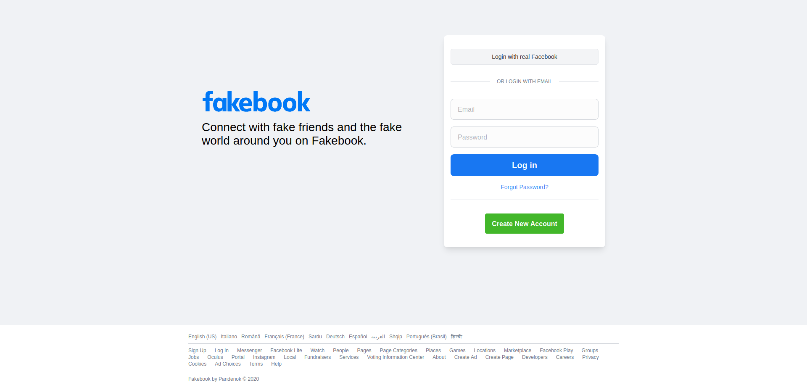
      
    </p>
  </details>  
  <details>
    <summary float="left">Some interesting key-points about `omniauth-facebook`</summary>

    The process of implementation of Facebook OAuth2 strategy for OmniAuth is very well documented on their [GitHub page](https://github.com/simi/omniauth-facebook), there is also a Facebook example on [Devise's page](https://github.com/heartcombo/devise/wiki/OmniAuth:-Overview), without mentioning plenty of tutorials, youtube videos and blogs showing how to do it. Here are my findings while building this feature:
    1. You need to know as well that for going live with Facebook you'll need to accompish a series of additional tasks, like do a privacy policy, provide an App icon, list valid OAuth redirect URIs.
    2. If you're installing `omniauth-facebook` it will come with an `omniauth` generic gem. In my case it lead to an `Error: Not found. Authentication passthru.` It took me some time to find a solution [here](https://github.com/heartcombo/devise/issues/5236). If you're struggling like me, please be my guest. 
  </details>  
- A onetime welcome email is sent to a new user during sign up using `letter opener` in test and development and `SendGrid` in production (*edit: my SendGrid account was disabled, so ActionMailer is configured to use Gmail*).
  <details>
    <summary float="left">Click to see screenshots</summary>

    <p float="left">
      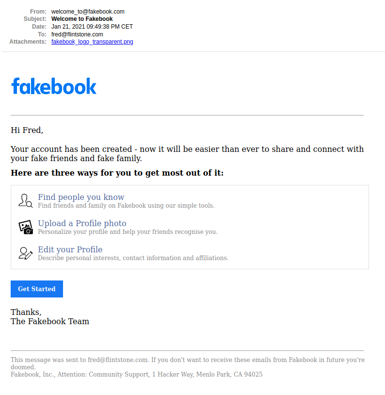
      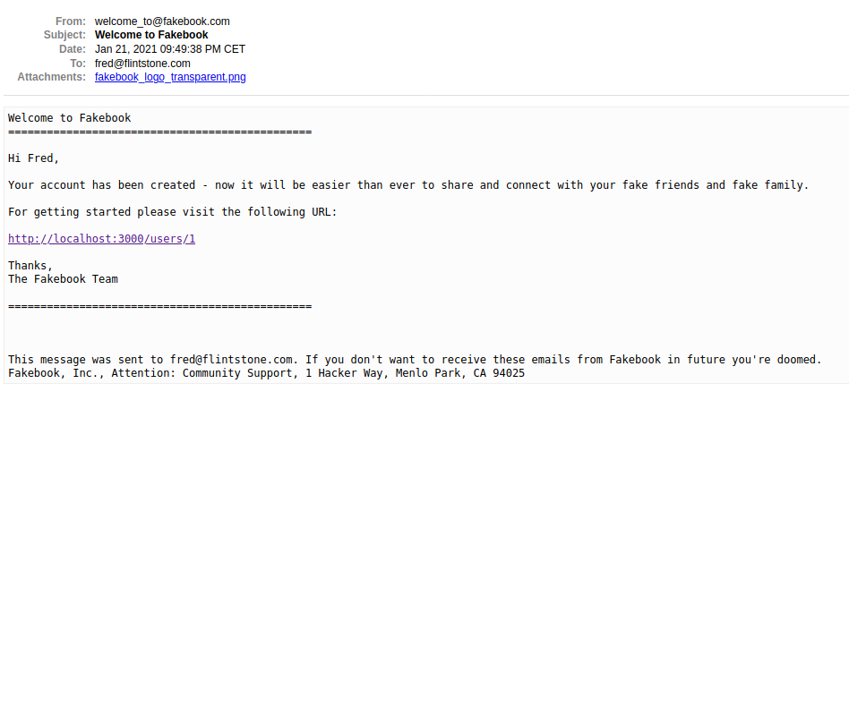
    </p>
  </details>  

### User's Profile
- Active Storage was used in combination with Amazon S3 in production to allow user to upload an avatar picture and/or cover photo.
  <details>
    <summary float="left">Click to see screenshots</summary>

    <p float="left">
      
      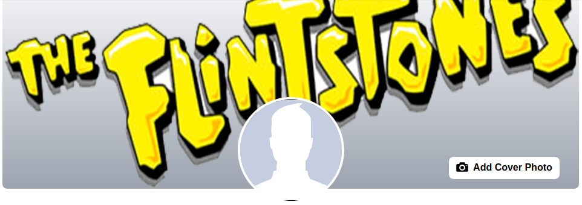
      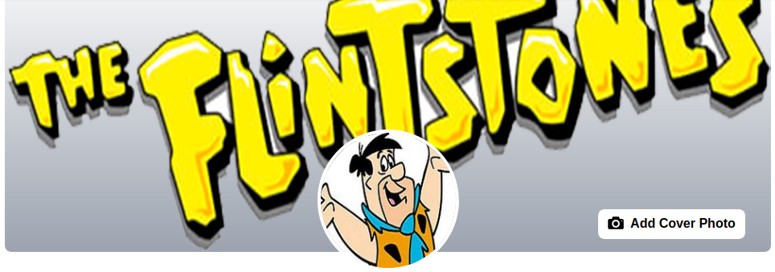
    </p>
  </details>  
- a custom Blob validator is used to check file type (jpeg, jpg and png) and size (up to 1Mb).
  <details>
    <summary float="left">Click to see screenshots</summary>

    <p float="left">
      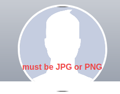
      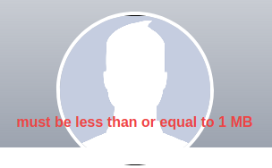
      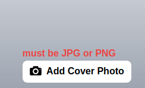
      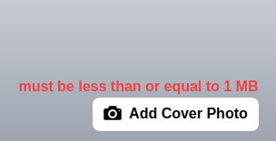
    </p>
  </details>  
- For profiles with no avatar a graceful facebook's male or female silouhette is shown by default.
  <details>
    <summary float="left">Click to see screenshots</summary>

    <p float="left">
      
      
    </p>
  </details> 
- Profile details are editable only by the owner.
  <details>
    <summary float="left">Click to see screenshots</summary>

    <p float="left">
      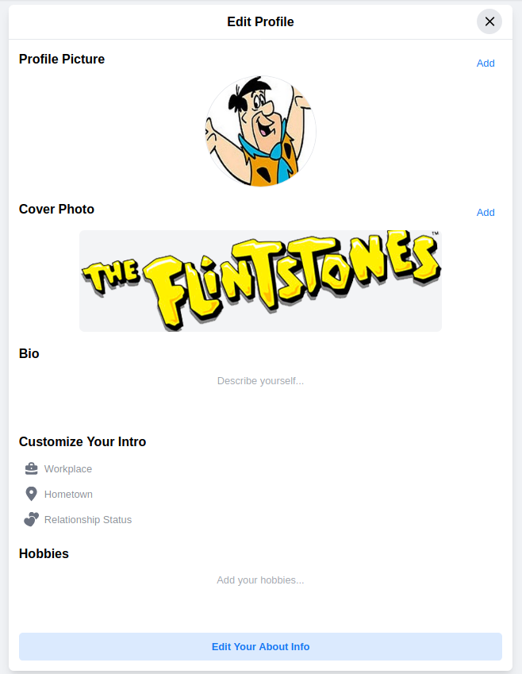
    </p>
  </details> 

### Friend Requests
- users can accept/decline or send friend requests.
  <details>
    <summary float="left">Click to see screenshots</summary>

    <p float="left">
      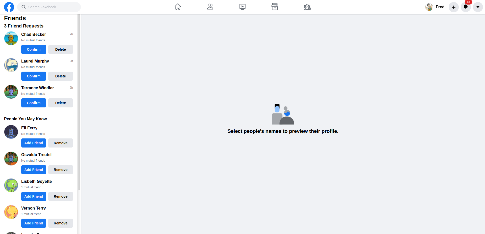
    </p>
  </details> 
- users can preview other user's profile without a full page reload using AJAX and JQuery.
  <details>
    <summary float="left">Click to see screenshots<?small></summary>

    <p float="left">
      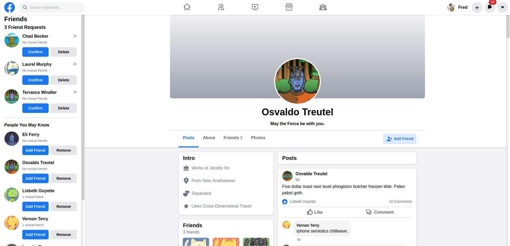
    </p>
  </details> 
- declined request can not be resent afterwards as in real Facebook.

### Posts, Comments, Likes
- users can create posts from news feed, profile or navbar.  
  <details>
    <summary float="left">Click to see screenshots</summary>

    <p float="left">
      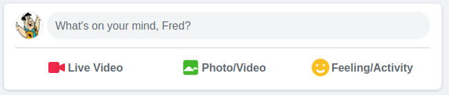
      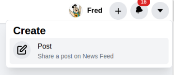
    </p>
  </details>  
- posts can be edited and deleted only by the author.
  <details>
    <summary float="left">Click to see screenshots</summary>

    <p float="left">
      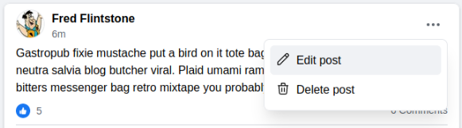
    </p>
  </details> 
- posts allow images as well as text.
  - Blob validator is used to check file type (jpeg, jpg and png), size (up to 1Mb) and max number of uploads (limit: 5).
  - the layout of attached images is dynamic in base of number of uploads.
    <details>
      <summary float="left">Click to see screenshots</summary>

      <p float="left">
      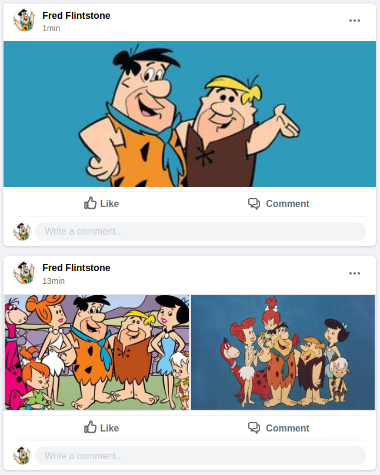
      </p>
    </details> 
  - each image is clickable and expandible in a new window in its original size and dimensions.
  <details>
    <summary float="left">Click to see screenshots</summary>
    
    <p float="left">
      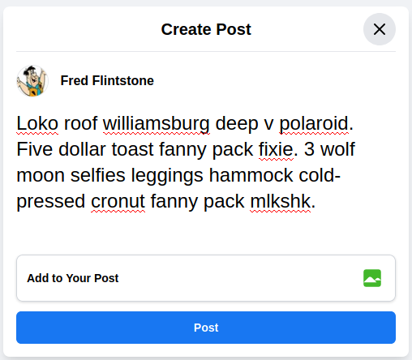
      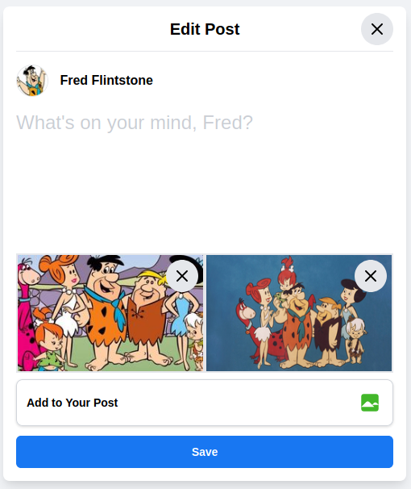
    </p>
  </details> 
- news feed contains all the posts of the user's network ordered by creation time.
  <details>
    <summary float="left">Click to see screenshots</summary>

    <p float="left">
      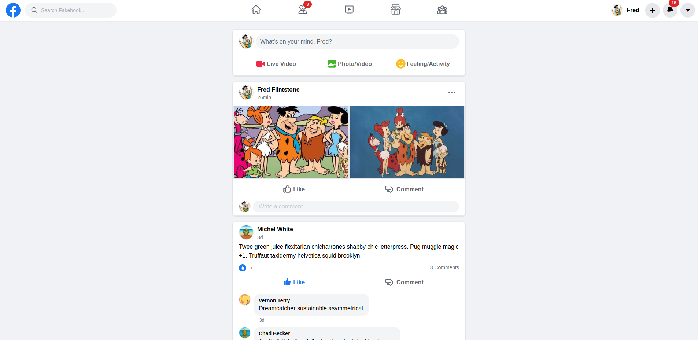
    </p>
  </details> 
- users can comment on posts. 
  - comments can be edited inline with no page refresh using Rails UJS.
  - comments can be edited and deleted only by the author.
    <details>
      <summary float="left">Click to see screenshots</summary>
      
      <p float="left">
      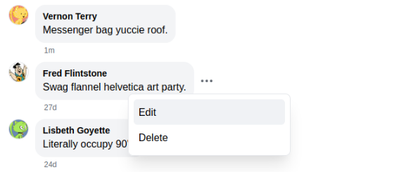
      </p>
    </details> 
- users can like/unlike posts. 
  - only one like per post per user is admitted.

### Notification System
- triggered when a user receives/accepts/rejects a friend request, or when a user comments on/likes a post
- always reachable through a handy dropdown with a nice count badge on the main navbar
  <details>
    <summary float="left">Click to see screenshots</summary>

    <p float="left">
      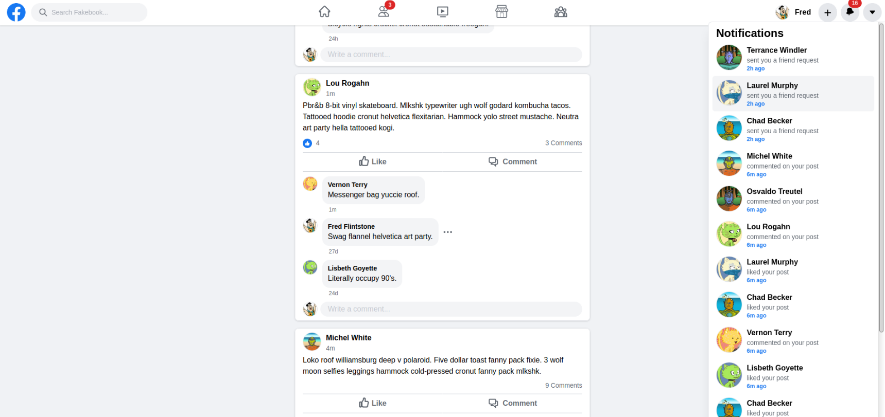
    </p>
  </details> 
- separated by each notification type through polymorphic association.
  <details>
    <summary float="left">Click to see screenshots</summary>
  
    <p float="left">
      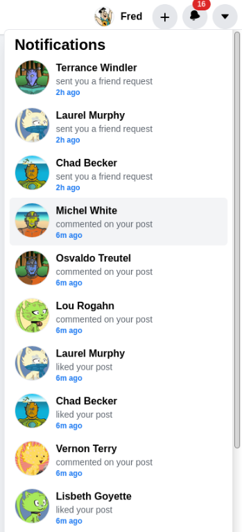
    </p>
  </details> 
- marked as read if user clicks on it.

### Front-end Look
- Fakebook is made to have a close look to Facebook (obviously, with less content and features). To achieve this, styling was done using Tailwind 2.0. IMHO, it's the most close replica of original Facebook I've seen.
  <details>
    <summary>Read more</summary>  

    If you haven’t heard of [Tailwind CSS](https://tailwindcss.com) yet, it is a CSS framework filled with a lot of preset CSS classes, which you can apply to your HTML elements, without the need to write custom CSS for them most of the time!  

    It took me some time to figure out how to set it up, because I encounted a series of problems like
    
    - `Error: PostCSS plugin tailwindcss requires PostCSS 8`, so I needed to install it with `compat` [channel](https://tailwindcss.com/docs/installation#post-css-7-compatibility-build).
    
    - `Node Sass does not yet support your current environment: Windows 64-bit with Unsupported runtime (88)`, so make sure that your Node package is updated and it's 12+ and 15- otherwise you'll have problems as well, because node-sass does not support Node 15 (runtime **) currently and it will come with when v5 is published to NPM. 
    
    - If you notice, like me, that the style didn’t change even after you have added some classes, try open terminal and run `./bin/webpack-dev-server` alongside with rails server so that the styling can be refreshed. 
    
    Despite all of these headaches and after making projects with Bootstrap, Bulma, Materialize, I can definitely tell that I'm a big fan of Tailwind. That’s it. Go read the Tailwind [docs](https://tailwindcss.com/docs) to find out more about this awesome CSS framework and style your app to your heart's content.
  </details>  

### Complete test suite
- 109 examples of system, request and unit tests

## Built With

- Ruby (3.0.0) on Rails (6.1.1) - Web framework
- Tailwind 2.0 - HTML/CSS framework
- Heroku - Cloud platform/server
- PostgreSQL - Database
- SendGrid/Gmail - Email delivery service
- Rspec/Capybara - Testing framework

## Dependencies

- Webpacker - Popular JavaScript tool used for managing and bundling JavaScript code
- Devise - Flexible authentication solution for Rails based on Warden
- Omniauth-facebook - Facebook OAuth2 Strategy for OmniAuth
- Figaro - Rails app configuration using ENV and a single YAML file
- Jquery-rails - Provides jQuery and the jQuery-ujs driver for your Rails 4+ application
- Aws-sdk-s3 - Official AWS Ruby gem for Amazon Simple Storage Service (Amazon S3)
- Faker - Used to easily generate fake data: names, addresses, phone numbers, etc
- Image_processing - High-level wrapper for processing images for the web with ImageMagick or libvips
- Better_errors - Provides a better error page for Rails and other Rack apps.
- Letter_opener - Opens an email preview in the browser instead of sending.
- Factory_bot_rails - a fixtures replacement with a straightforward definition syntax
- Shoulda-matchers - Provides RSpec-compatible one-liners to test common Rails functionality
- Rexml - An XML toolkit for Ruby. Needed for Rspec tests.

## Database Requirements

The application, by default, runs on PostgreSQL, using the default role name - same as the operating system user. So, you should either create a database user with the same username, or tell the application to use your custom database access info via the `config/database.yml` configuration file.  

## Getting started

If you want to play with the app locally, make sure you have Rails and Git installed on your machine  
<details>
  <summary>Get instructions</summary>

  Clone the repo to your local machine: 
  ```ruby
  $ git clone git@github.com:Pandenok/fakebook.git
  ```
  Then, install the needed gems:
  ```ruby
  $ bundle install
  ```
  Next, migrate the database:
  ```ruby
  $ rails db:migrate
  ```
  If you want to load sample functional users to mess with, use seeds:
  ```ruby
  $ rails db:seed
  ```
  To create an `application.yml` file where you can safely store environment variables, run 
  ```ruby
  $ bundle exec figaro
  ```
  At this point you should be able to run the tests
  ```ruby
  $ rspec
  ```
  Finally, on root path run a local server:
  ```ruby
  $ rails server
  ```
  Open browser to view application:
  ```ruby
  localhost:3000
  ```
</details>   

## Data Models  
<details>
  <summary>Click to see a datamodel diagram</summary>

  <p align="center">
    <figure align="center">
      <figcaption>Data Models Diagram</figcaption>
      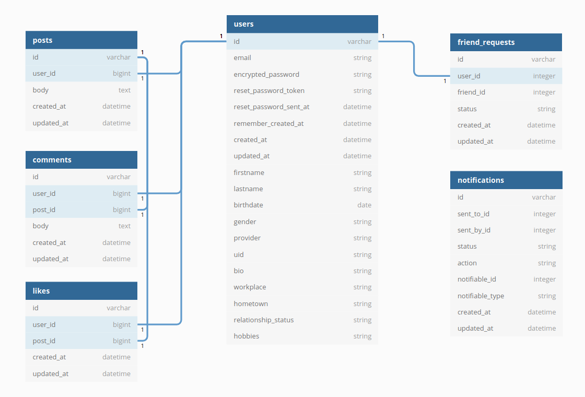
    </figure>
  </p>
</details>        

The primary challenge was configuring user associations, given that, in a symmetrical, Facebook-style relationship, a user can be either a user requesting a friendship or a user receiving a friendship request. There are many different ways to form a bi-directional friendship model, and the way I built it is for sure far away from perfection. But totally working. And the most important thing it works as I *wanted* it to work!

The FriendRequest status starts with enum "pending" state, which it remains for both users until the requested user accepts the request. Doing it this way takes away the need for callbacks or reverse association for the other friend. The most important thing it keeps the association methods intact, including implicit association creation: `user.friends`! That's perfect, but what I want is to also be able to go in the other direction (kinda `friend.friends`). This was a pain to figure out how to write a join table that references two users reciprocally: by using the -> { ... } block, we can pass in the instance of user and insert any typical Relation methods we would normally use when writing ActiveRecord queries. The final result you can see in my User model.

## Reflection
I have had a great experience so far with Rails, this project is not an exception, it helped me to get to grips with more complicated aspects. I really enjoyed doing this project and I hope it showcases some of Rails skills, even if not I personally definitely benefited from learning while doing it: so many things are a lot more clear to me now after finishing this app! I really felt the lack of Javascript in this project (e.g., for liking or commenting, or modals for creating/editing posts). However I think I found a nice work around for some things, like dropdowns menus on hover, editing of comments in place or profile's preview on click which helped to improve UX. From UI point of view, I relied on fantastic Tailwind 2.0, and I think it was worth it. I'm definitely proud of creating a very close clone to original website. There are still many things to do, but I decided to cut some features from the application in order to move on with The Odin Project. You can see them in the next [Pipeline](#pipeline) section.

## Pipeline

- [ ] Responsive design
- [ ] Comment on comments (nested comments)
- [ ] Like comments
- [ ] Search for users
- [ ] Realtime notifications
- [ ] Posts to a friend's wall
- [ ] Different kind of likes
- [ ] Modals for Create/Edit Post and Sign Up views

## Other

If you've made it through reading all this, there is nothing else to do than to head over to [Fakebook](https://nameless-tor-20288.herokuapp.com/).